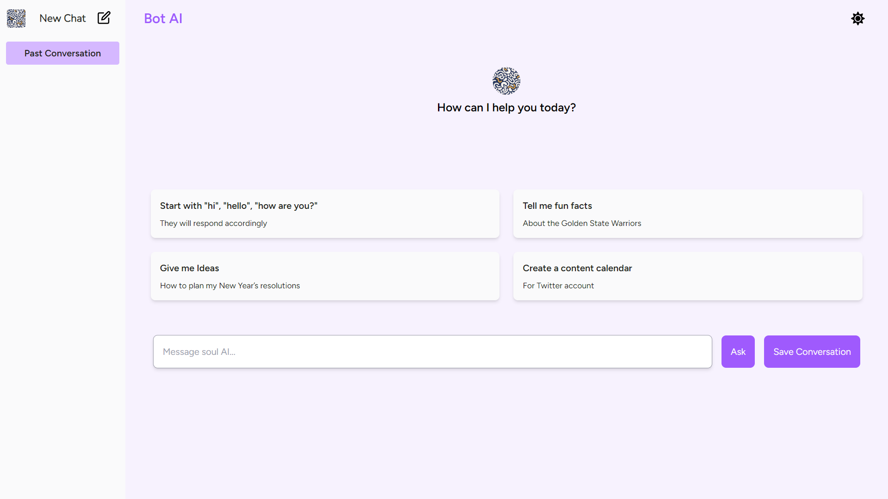
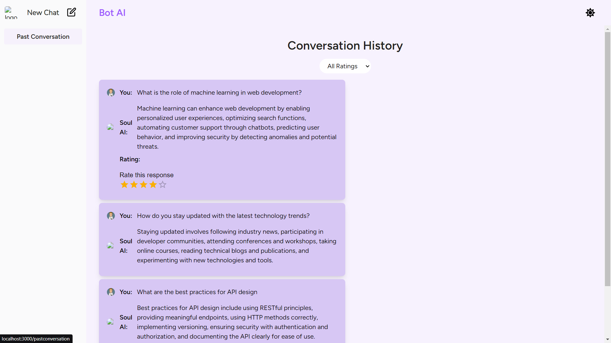

# AI Chat and Feedback Web Application

A ReactJS-based web application where users can chat with an AI model and provide feedback on the conversation. This project demonstrates advanced React concepts, state management, and UI/UX design with a focus on accessibility and user interaction.
## 📸 Screenshots

### Home Page (AI Chat Interface)

### Conversation

## 🌟 Features

- **AI Chat Interface**: Users can chat with a mock AI model, with responses generated from a JSON file.
- **Feedback System**:
  - Like/Dislike responses with floating thumbs up/down buttons.
  - Provide a rating (1–5 stars) at the end of the conversation.
  - Share subjective feedback via a text input.
- **Conversation Management**:
  - Save multiple conversations and revisit them from a panel.
  - View feedback for each past conversation.
- **Feedback Dashboard**:
  - View all feedback across conversations.
  - Filter feedback based on ratings.
- **Dark Mode**: Toggle between light and dark modes for improved Ui, working on it.
  
## 🚀 Live Demo

- [Deployed Application on Vercel](https://chatbot-app-sage-theta.vercel.app/)

